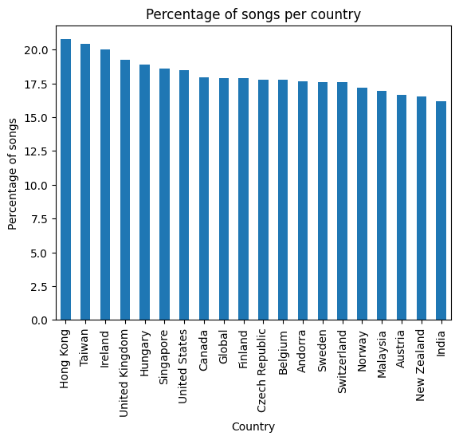
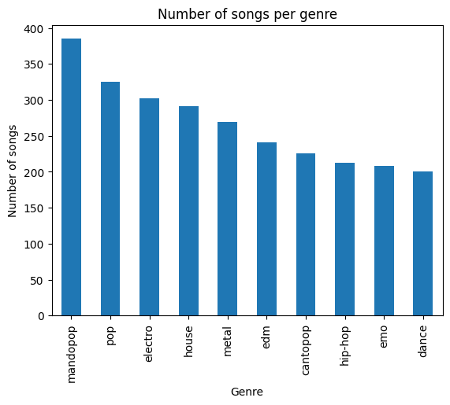
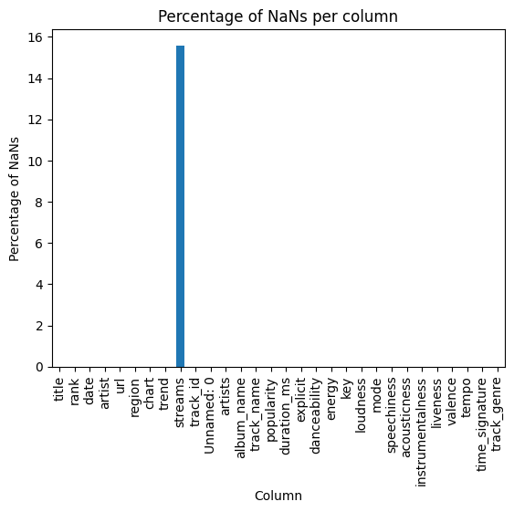

Com-480 Data Visualization Course, EPFL. 

Project page of group TnT (Théo & Théo)

## Milestone 1

### Dataset

The main dataset that we plan on using that most fit what we have in mind are 
- [Spotify Tracks Dataset](https://www.kaggle.com/datasets/maharshipandya/-spotify-tracks-dataset): This is a dataset of Spotify tracks over a range of 125 different genres. Each track has some audio features associated with it.  Great usability note on kaggle (10), so we don't expect that it will be too hard to work with. Contains about 90'000 songs.
- [Spotify Charts](https://www.kaggle.com/datasets/dhruvildave/spotify-charts): Big dataset with a lot of columns for each song. Importantly, it contains information about the ranking (top200, hot50) and geographic information which could be interesting for our problematic.

Additionally, we have a few backup dataset that we might want to consider later on, also because they come from other sources than spotify which might be interesting.

- [Billboard Hot-100 2000-2023](https://www.kaggle.com/datasets/suparnabiswas/billboard-hot-1002000-2023-data-with-features): Captures song rankings over the decades, offering insights into music trends. Great useability note. It contains over 2000 songs from 2000 to 2023 with interesting features such as danceability, loudness, energy and acoucstiness. However, we expect that most of the songs in this dataset are contained in the spotify charts dataset above.
- [Million Song Dataset](http://millionsongdataset.com/): Enormous dataset (280Gb) although there exist a sample version (1.8Gb). It contains information about a lot of songs but it might be hard to work with although it is well documented. We might want to keep it in mind for doing large scale statistics.

### Problematic

**Overview & Motivation**

Music is a universal language, yet its trends and influences vary across cultures and regions. By analyzing data on music charts, geographical regions, danceability, and genres, Databeats seeks to uncover patterns in mainstream and underground music. Are there global hits that dominate everywhere, or do local preferences shape unique trends? How do underground genres influence mainstream music?

**Main Axes of Development**

1. **Global vs. Regional Trends** – Analyzing which songs and genres dominate worldwide vs. those popular in specific regions.
2. **Evolution of Music Trends** – Visualizing how music preferences change over time, highlighting genre shifts and emerging styles.
3. **Musical Characteristics & Popularity** – Investigating danceability, energy, and other musical attributes that correlate with mainstream success.
4. **Underground Influence** – Exploring the role of niche genres and subcultures in shaping mainstream music.

**Target Audience**

- **Music Enthusiasts & Historians** interested in the evolution of music trends.
- **Artists & Producers** looking to understand how underground genres influence the mainstream.
- **Data Analysts & Researchers** exploring cultural trends through music.

This visualization will provide insights into the factors shaping musical taste and the connections between underground and mainstream music.

### Exploratory Data Analysis

See jupyter notebook. We only explore the main datasets as we are not sure to use our backups.

We merged the two spotify datasets together which results in 11'293'758 entries and 6894 unique songs. Since the spotify charts dataset contains multiple times a single song for each of each it position in the charts (i.e., as the song moves through the ranks) in each of the countries in which the song got in the charts and the spotify tracks dataset containes multiple times the same song for each of its genre, then a song will appear multiple times in the merge dataset. We keep it that way for now as we don't know exactly know what we will do with it and thus it might be preferable to keep it that way.

Let's now see some statistics

- The dataset countains song in the carts for 70 different countries. Here is the distribution of the amount of (unique) songs per country for the top 10 countries (in percent of total unique songs)  
- The average number of genre per song is 1.45. 
- The datasets contains 110 different genres. The top 10 genres with the most songs are 
- The dataset contains only songs from the top200 songs.
- Overall, the dataset does not contain a lot of NaNs. Actually, only the `streams` column contains NaNs (around 16%) which we don't really care about. Here is the complete plot 

A lot of the column contain information about the song such as its valence, acousticness, danceability, etc... which might be super interessant for our analysis.

### Related Work

Previous studies have explored music genre classification and recommendation systems. Some inspiring visualizations include:

- [Musica Ex Machina](https://epfl-pavilions.ch/en/exhibitions/musica-ex-machina): Exhibition at EPFL Pavilions. Showcases some ways of visualizing sounds and music.
- [Visualizing Popular Genres of Music](https://datainnovation.org/2021/09/visualizing-popular-genres-of-music/): Website showing a nice way of visualizing genres. Could be an inspiration.
- [https://musicmap.info](https://musicmap.info/): Really nice visual of genres, their popularity and the links amongst them. Nice interactions with the data as well.
- [Every Noise](https://everynoise.com/): Really interesting approach at showing genres and their relations. It also allows playing quick previews of the genres which can be a fun feature to have. Suggested by Professor Gilles.
- [Exploring the tale of music through data visualization](https://www.analyticsvidhya.com/blog/2020/12/exploring-the-tale-of-music-through-data-visualization/): Cool little story telling website that resembles what we have in mind but may be a bit too simple in terms of data visualization.
- [History of Rock'n'roll in 100 songs](https://www.svds.com/rockandroll/#thebeatles): A visualization tracing the milestones in the evolution of rock and roll, highlighting influential artists and tracks. Uses some nice linked data which could be an inspiration.
- [Music feature visualization](https://sreeranjanid.github.io/): An interactive tool allowing users to explore the history of music genres from 1930 to 2020, highlighting characteristics and popularity trends. Nice interactions.